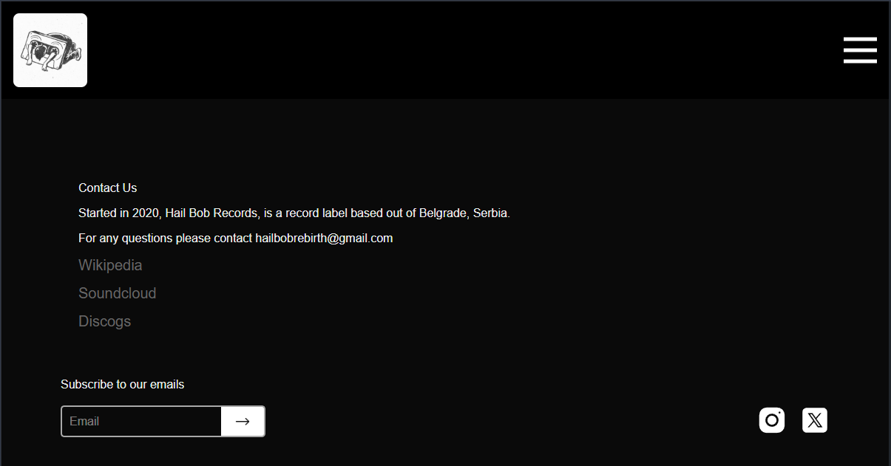

# 🎧 Hail Bob Records

A modern web platform for an independent electronic music label — inspired by [L.I.E.S. Records](https://liesrecords.com/) and designed with motion-driven, interactive visuals.



## 🚀 Tech Stack
- **Next .js 15 (App Router)**
- **React 18**
- **Tailwind CSS / Framer Motion**
- **TypeScript**
- **Cloudflare Pages for deployment**
- **WordPress REST API (for future content integration)**

## 🧠 Concept
Hail Bob Records is a web space combining minimalism and raw visual energy typical of underground labels.  
The goal is to make a site that *feels alive* — every scroll, hover, or page transition adds motion, not clutter.

## 📱 Features
- Responsive / **Mobile-first** layout  
- Animated transitions with Framer Motion  
- Sidebar navigation and drawer menu on mobile  
- Modular page structure with Next App Router  
- CMS integration via WordPress API (soon)

- ## 🧩 Structure
├── layout.tsx → global layout & header/footer
├── preorders/ → Pre-orders page
├── releases/ → List of releases
├── artists/ → Artist profiles
└── about/ → Label info page


## 💻 Development
Clone & run locally:
```bash
git clone https://github.com/Zitz59/hail-bob-records
cd hail-bob-records
pnpm install
pnpm dev
```

Deployment → Cloudflare Pages

🌱 Roadmap

 Connect WordPress REST API

 Add music player component/or songs and albums preview

 Implement SEO meta tags and OpenGraph preview

 Accessibility audit (Lighthouse AA)

 Add dark / light mode switch

🧑‍🎨 Author

Aleksandr Zaitsev — Frontend Developer
[🌐 Portfolio](https://hail-bob-records.pages.dev/)
[💼 LinkedIn](https://linkedin.com/in/aleksandr-zaitsev-322354235)
[📧 Email](mailto:Aleks.Zaitsev@proton.me)

Built with passion for sound and motion.
